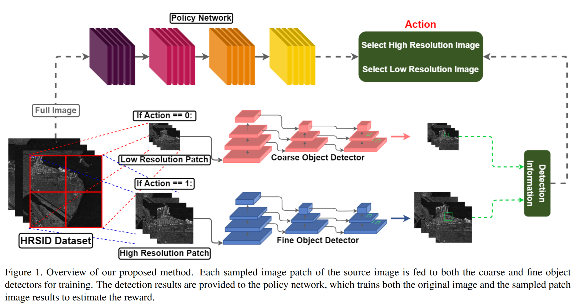

# SAROD: Efficient End-to-end Object Detection on SAR Images withReinforcement Learning
Anonymous WACV submission

Yolov3: https://github.com/eriklindernoren/PyTorch-YOLOv3

Yolov5: https://github.com/ultralytics/yolov5

mmdetection: https://github.com/open-mmlab/mmdetection

EfficientObjectDetection: https://github.com/uzkent/EfficientObjectDetection


## Overview of our framework.



## Clone
```
git clone https://github.com/anonymous-hub/SAROD
```

## Dataset
HRSID Dataset can be downloaded in [here](https://github.com/chaozhong2010/HRSID)

Pre-Processed dataset for the result can be downloaded by running the file or [here](https://drive.google.com/file/d/179XJTHn93KVHzOyPy4grE808Oaxf4jDe/view?usp=sharing).

A example script for downloading the testset is as follows:
```
# Download the dataset
cd dataset
bash download_HRSID_cropped.sh
cd ..
```

## Download pre-trained model weights
The pretrained weights can be downloaded by running the files or [here](https://drive.google.com/file/d/19AiETn2MAdzrKsYvmJiYurzU5k2VmX8R/view?usp=sharing).

```
# Download the pre-trained SAROD weights
cd weights
bash download_SAROD_RL_weight.sh
bash download_yolov5_480_weight.sh
bash download_yolov5_96_weight.sh
cd ..
```

```
# Download the pre-trained baseline weights
cd weights
bash download_yolov3_480_weight.sh
bash download_yolov3_96_weight.sh
bash download_retinanet_weight.sh
bash download_faster_rcnn_weight.sh
cd ..
```


## Setup
```
pip install -r requirements.txt
```

## Train
refer to 'demo_training.ipynb'
```
!python train.py --epochs 10\
--detector_batch_size 4\
--device 2\
--test_epoch 1\
--eval_epoch 1\
--step_batch_size 2\
--save_path save
```

## Evaluation
refer to 'demo_evaluation.ipynb'
```
!python test.py --epochs 1\
--detector_batch_size 1\
--device 0\
--test_epoch 1\
--eval_epoch 1\
--rl_weight SAROD_RL\
--h_detector_weight yolov5_480.pt\
--l_detector_weight yolov5_96.p
```

